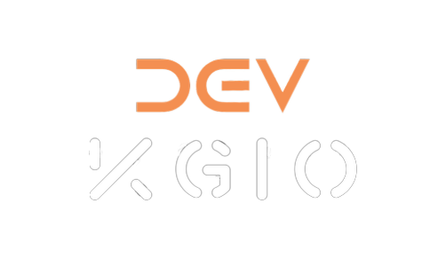

<!-- PROJECT LOGO -->
 

  
<h3 align="center">Dev chat application </h3>
  

    A chat application with sign up and log in features. A database hosted in <a href="https://getstream.io/chat/">stream.io</a> is used for user logs. Also the application is set up with <a href="https://www.twilio.com">Twilio</a>, which sends sms notifications to the user when they have a new message (under debugging).
     
    <a href="https://github.com/KonsGio/Dev-chat"><strong>Explore the docs »</strong></a>
     
     
    <a href="https://kgio-dev-chat-app.netlify.app">View Demo</a>
    ·
    <a href="https://github.com/KonsGio/Dev-chat/issues">Report Bug</a>
    ·
    <a href="https://github.com/KonsGio/Dev-chat/issues">Request Feature</a>
  

<!-- ABOUT THE PROJECT -->
## About The Project

[![https://kgio.dev][product-screenshot]](https://kgio.dev)

(<a href="#top">back to top</a>)

### Built With

* [![React][React.js]][React-url]
* [![TYPESCRIPT][TYPESCRIPT]][TYPESCRIPT-url]
* [![POSTCSS][POSTCSS]][POSTCSS-url]
* [![STREAM][STREAM]][STREAM-url]
* [![TWILIO][TWILIO]][TWILIO-url]

### Check this out

* [![KGIO.DEV][SITE]][SITE-url]
* [![LinkedIn][linkedin-shield]][linkedin-url]

(<a href="#top">back to top</a>)

<!-- LICENSE -->
## License

Distributed under the Apache License 2.0. See `LICENSE.txt` for more information.

(<a href="#top">back to top</a>)

<!-- CONTACT -->
## Contact

Konstantinos Giovanitsas - <a href="mailto:konstantinos.giovanitsas@yahoo.com">Send me an email</a>

(<a href="#top">back to top</a>)

<!-- MARKDOWN LINKS & IMAGES -->
<!-- https://www.markdownguide.org/basic-syntax/#reference-style-links -->
[linkedin-shield]: https://img.shields.io/badge/-LinkedIn-black.svg?style=for-the-badge&logo=linkedin&colorB=555
[linkedin-url]: https://www.linkedin.com/in/konstantinos-giovanitsas-10b511150/
[product-screenshot]: public/dev-chat.png
[SITE]: https://img.shields.io/badge/kgio.dev-0A0A0A?style=for-the-badge&logo=dev.to&logoColor=white
[SITE-url]: https://www.kgio.dev
[React.js]: https://img.shields.io/badge/React-20232A?style=for-the-badge&logo=react&logoColor=61DAFB
[React-url]: https://reactjs.org/
[TYPESCRIPT]: https://img.shields.io/badge/TypeScript-F7DF1E?style=for-the-badge&logo=typescript&logoColor=black
[TYPESCRIPT-url]: https://www.typescriptlang.org
[POSTCSS]: https://img.shields.io/badge/PostCSS-FFFFFF?style=for-the-badge&logo=PostCSS&logoColor=FF5733
[POSTCSS-url]: https://postcss.org
[STREAM]: https://img.shields.io/badge/STREAM.IO-1A3EE1?style=for-the-badge&logo=Streamlit&logoColor=FFFFFF
[STREAM-url]: https://getstream.io/chat/
[TWILIO]: https://img.shields.io/badge/TWILIO-FFFFFF?style=for-the-badge&logo=Twilio&logoColor=FF5733
[TWILIO-url]: https://www.twilio.com
